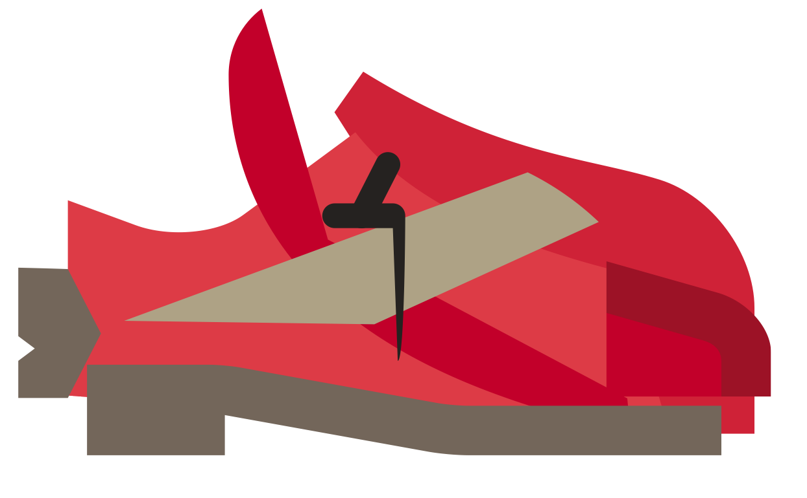

# ‍✅ GAN XML Fixer 🎨
### coded by: Allan Gelman
### concept by: Alexander Reben
### supported by [Stochastic Labs](http://stochasticlabs.org/)

This tool converts a txt file containing [text generated by a neural network](https://www.tensorflow.org/tutorials/sequences/text_generation) trained on Scalable Vector Graphics (svg files) into two directories, one containing the valid svg files produced, and one containing the invalid svg files produced. This tool's key feature is that it attempts to correct every invalid file, thereby producing more than 150% of the original number of valid files (specifics in the Testing section)! 

## Prerequisites 
This tool uses [xmlschema](https://github.com/brunato/xmlschema). To import xmlschema into a Python 2.7 or 3.4+ environment, run this command:

    pip install xmlschema

## How To Use
In the command line, cd into the root of this repository and run this command (replacing "my_txt_file.txt" with the name/path of your txt file). This will create two directories in the root of this repo named 'invalid_svg' and 'valid_svg', by default:

    ./vcc.py -txt my_txt_file.txt

If you want to customize the path or name of the directories created, run this command:

    ./vcc.py -txt my_txt_file.txt -idir invalid_custom_name -vdir valid_custom_name

If you want to see a help menu for this tool in the command line, run this command:
    
    ./vcc.py -h

## Naming System

By default, the two directories created are called 'invalid_svg' and 'valid_svg'.

Files produced are named simply by the order that they were produced in (0.svg, 1.svg, 2.svg, etc.). Some files will have certain prefixes before the number to indicate if it has been altered or not (illustrated in the example below).

Here are examples of what the contents of each directory could look like, and what the names of the files inside indicate: 

* invalid_svg:
    * #.svg => an invalid file that was unable to be corrected
    * orig_#.svg => the original invalid version of a now corrected file in the 'valid_svg' directory


* valid_svg:
    * #.svg => a valid file without any correction 
    * x_corrected_#.svg => a valid file that has had some number of attempts of correction applied
        * 1x => first attempt; all the 'g' tags were removed
        * 2x => second attempt; any extra quotation marks were removed, and any necessary quotation marks were added 
        * 3x => third attempt; any redefinitions of the 'viewBox' or 'd' attributes were removed 
        * 4x => fourth attempt; any missing 'path' end tags were added


## How it Works

### 1) File Division
First, the inputted txt file is divided into individual svg files by splitting on the 'svg' end tag. All the files are initially placed in the 'invalid_svg' directory. 

### 2) Validation and Classification
Next, the tool iterates over all the files, and validates them. The valid svg files are moved from the 'invalid_svg' directory to the 'valid_svg' directory.

Validation is done using [xmlschema](https://github.com/brunato/xmlschema), which validates files written in XML (like svg files!) against a schema. A [schema](https://www.w3schools.com/xml/schema_intro.asp) is an xsd file that lists rules indicating which elements, attributes, nesting structures, and references are valid in a type of file written in XML. This tool uses a custom-made schema, with added flexibility to account for the unpredictable results of the neural network, to validate specifically svg files.

For example, below is a segment from the schema which describes the attributes allowed for the 'rect' element (a rectangle element). Things to note about the added flexibility are:

* the use of every attribute is `use = "optional"`
* most of the attributes' types are `string`, as oppose to more restricting types, like `float` or `byte`
* many of the attributes are actually not meant for a `rect` element, like `rx`, which is meant for an `ellipse` element

```xsd
  <xs:element name="rect">
    <xs:complexType>
      <xs:simpleContent>
        <xs:extension base="xs:string">
          <xs:attribute type="xs:string" name="transform" use="optional"/>
          <xs:attribute type="xs:string" name="id" use="optional"/>
          <xs:attribute type="xs:float" name="x" use="optional"/>
          <xs:attribute type="xs:float" name="rx" use="optional"/>
          <xs:attribute type="xs:float" name="y" use="optional"/>
          <xs:attribute type="xs:float" name="width" use="optional"/>
          <xs:attribute type="xs:float" name="height" use="optional"/>
          <xs:attribute type="xs:string" name="class" use="optional"/>
          <xs:attribute type="xs:string" name="style" use="optional"/>
          <xs:attribute type="xs:string" name="fill" use="optional"/>
          <xs:attribute type="xs:string" name="fill-opacity" use="optional"/>
          <xs:attribute type="xs:string" name="fill-rule" use="optional"/>
          <xs:attribute type="xs:string" name="opacity" use="optional"/>
          <xs:attribute type="xs:string" name="filter" use="optional"/>
          <xs:attribute type="xs:string" name="stroke-linecap" use="optional"/>
          <xs:attribute type="xs:string" name="stroke-linejoin" use="optional"/>
          <xs:attribute type="xs:string" name="stroke" use="optional"/>
          <xs:attribute type="xs:string" name="stroke-width" use="optional"/>
          <xs:attribute type="xs:string" name="stroke-miterlimit" use="optional"/>
          <xs:attribute type="xs:string" name="stroke-opacity" use="optional"/>
          <xs:attribute type="xs:string" name="mask" use="optional"/>
        </xs:extension>
      </xs:simpleContent>
    </xs:complexType>
  </xs:element>
```

### 3) Correction Attempts
Lastly, the tool iterates over all the remaining files in the 'invalid_svg' directory, and attempts to correct them. This correction occurs recursively, attempting in order (1 - 4) to apply the next level of correction until the file is finally valid. Once the file is corrected, the corrected version is moved to the 'valid_svg' directory, with the naming specified above. If after the fourth attempt, the file is still invalid, it remains in the 'invalid_svg' directory.

## Testing
From my tests, I produced 534 svg files. 

Without the corrections of my tool, 225 files were valid. 
With the correction of my tool, 352 files were valid. 

### Number/Percent Valid of Total 534
| w/o Corrections | w/ Corrections| 
| :--------------:|:-------------:| 
| 225             | 352           | 
| 42.1%           | 65.9%         | 

### **352 is 156% of the original number of valid files!**

## Examples!

I have been using the free online databases of icons, [Flaticon](https://www.flaticon.com/) and [The Noun Project](https://thenounproject.com), to create my training sets! Here are some of the coolest/weirdest/wackiest results I got!

### Trained on Shoe Icons 👟:

&nbsp;  

&nbsp; 

&nbsp; 

### Trained on Building Icons 🏢:

&nbsp;  

&nbsp; 

&nbsp; 

### Trained on Flower Icons 🌺:

&nbsp;  

&nbsp;  

&nbsp;  


## Tips for Optimizing Results

* Don't get discouraged! If you don't get a cool output at first, try again! Just keep training, just keep training!
* The more files you use in your training data set, the better! Training sets with 500+ files have resulted in interesting outputs for me.
* Try to include repetitive or similar files in your training data set! I noticed that the more similar the files are, the better the neural network learns! 
    * To create a repetitive data set, you can have duplicates of the same file. Having about 20 duplicates for every file in the dataset resulted in interesting outputs for me! (ex: duplicate 25 unique svg files 20 times each to create a data set of 500 files)
* You can open svg files in many ways. I noticed that opening them in a browser (like chrome or safari) results in a more interesting output that opening them in Adobe Illustrator. 
